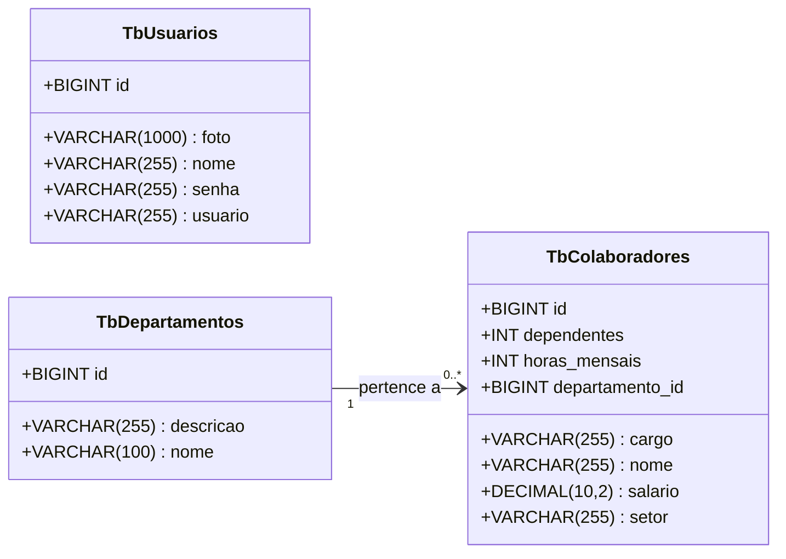

# NexumRH - Backend

<br />

<div align="center">
    
</div>


<br /><br />

## 1. Descrição

O NexumRH é um sistema de gestão de recursos humanos projetado para organizar, acompanhar e potencializar os processos internos de empresas.

A aplicação é estruturada em três entidades principais:

1. Usuário: representa os responsáveis pela gestão do sistema (administradores e gestores), com diferentes níveis de acesso e funções específicas, garantindo segurança e controle das operações.
2. Colaborador: centraliza os dados de funcionários da organização, reunindo informações de identificação, cargo, setor e demais dados relevantes para acompanhamento de sua trajetória profissional.
3. Departamento: organiza a estrutura interna da empresa, permitindo o cadastro e gerenciamento de setores, facilitando a vinculação de colaboradores e possibilitando  uma visão clara da distribuição de recursos humanos.

------

## 2. Sobre esta API

A API da NexumRH foi desenvolvida em Java, utilizando o framework Spring, e segue os princípios da Arquitetura MVC e REST. Ela disponibiliza endpoints para o gerenciamento dos recursos Colaboradores, Departamentos e Usuário, com testes de CRUD (Create, Read, Update e Delete) realizados por meio do Insomnia.

### 2.1. Principais Funcionalidades

1. Centralização das informações de colaboradores, setores e gestores em uma única plataforma.
2. Gestão eficiente de usuários, com perfis diferenciados de acesso e responsabilidade.
3. Organização hierárquica clara, por meio do relacionamento entre colaboradores e departamentos.
4. Controle completo do ciclo de vida do colaborador, desde o cadastro até movimentações internas.
5. Possibilidade de ampliação de funções extras, como: geração de relatórios de desempenho, faltas/ausências (taxas de absenteísmo), métricas para apoiar decisões estratégicas e integração via API com sistemas externos de folha de pagamento ou controle de ponto.


------

## 3. Diagrama de Classes

O Diagrama de Classes é um modelo visual usado na programação orientada a objetos para representar a estrutura de um sistema. Ele exibe classes, atributos, métodos e os relacionamentos entre elas, como associações, heranças e dependências.

Esse diagrama ajuda a planejar e entender a arquitetura do sistema, mostrando como as entidades interagem e se conectam. É amplamente utilizado nas fases de design e documentação de projetos.



------

## 4. Diagrama Entidade-Relacionamento (DER)

O DER (Diagrama Entidade-Relacionamento) do projeto Gestão de RH representa de forma visual como os dados estão organizados no banco de dados relacional e como as entidades se relacionam entre si.

<div align="center">
    
</div>

------

## 5. Tecnologias utilizadas

| Item                          | Descrição       |
| ----------------------------- | ----------------|
| **Servidor**                  | Apache Tomcat   |
| **Linguagem de programação**  | Java            |
| **Framework**                 | SpringBoot      |
| **ORM**                       | JPA + Hibernate |
| **Banco de dados Relacional** | MySQL           |

------

## 6. Requisitos
 
<br />
 
Para executar os códigos localmente, você precisará:
 
- [Java JDK 17+](https://www.oracle.com/java/technologies/javase/jdk17-archive-downloads.html)
- Banco de dados [MySQL](https://dev.mysql.com/downloads/)
- [STS](https://spring.io/tools)
- [Insomnia](https://insomnia.rest/download) 
 
<br />
 
## 7. Como Executar o projeto no STS
 
<br />
 
### 7.1. Importando o Projeto
 
1. Clone o repositório do Projeto [NEXUM RH](https://github.com/CodeQueensjava83/gestaorh) dentro da pasta do *Workspace* do STS
 
```bash
git clone https://github.com/CodeQueensjava83/gestaorh
```
 
2. **Abra o STS** e selecione a pasta do *Workspace* onde você clonou o repositório do projeto
3. No menu superior do STS, clique na opção: **File 🡲 Import...**
4. Na janela **Import**, selecione a opção: **General 🡲 Existing Projects into Workspace** e clique no botão **Next**
5. Na janela **Import Projects**, no item **Select root directory**, clique no botão **Browse...** e selecione a pasta do Workspace onde você clonou o repositório do projeto
6. O STS reconhecerá o projeto automaticamente
7. Marque o Projeto Loja Games no item **Projects** e clique no botão **Finish** para concluir a importação
 
<br />
 
### 7.2. Executando o projeto
 
1. Na Guia **Boot Dashboard**, localize o  **Projeto  crm_backend**
2. Selecione o **Projeto Gestão de RH_Backend**
3. Clique no botão **Start or Restart**  para iniciar a aplicação
4. Caso seja perguntado se você deseja autorizar o acesso ao projeto via rede, clique no botão **Permitir Acesso**
5. Acompanhe a inicialização do projeto no console do STS
6. Verifique se o banco de dados `db_gestaorh` foi criado corretamente e se as tabelas foram geradas automaticamente.
7. Utilize o [Insomnia](https://insomnia.rest/) para testar os endpoints.
 
<br />
 
> [!TIP]
>
> Ao acessar a URL `http://localhost:8081` em seu navegador, a interface do Swagger será carregada automaticamente, permitindo a visualização e a interação com os endpoints da API, bem como a consulta dos modelos de dados utilizados.
 
<br />

## 8. Contribuição
 
<br />
 
Este repositório é parte de um projeto educacional, mas contribuições são sempre bem-vindas! Caso tenha sugestões, correções ou melhorias, fique à vontade para:
 
- Criar uma **issue**
- Enviar um **pull request**
- Compartilhar com colegas que estejam aprendendo Java!
 
<br />
 
##  9. Contato
 
<br />
 
Desenvolvido por [**CodeQueens: Carina, Luana, Maria, Milena, Myriam, Rafaela**](https://github.com/CodeQueensjava83)
Para dúvidas, sugestões ou colaborações, entre em contato via GitHub ou abra uma issue!bra uma issue!